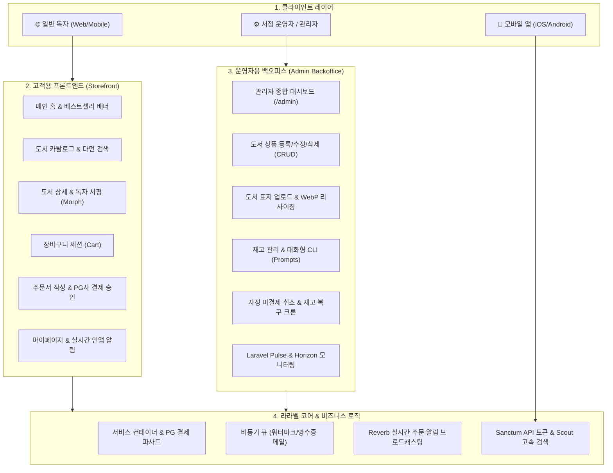

# 📚 Laravel 13.x 공식 문서 및 지니샵(JinyShop) 14주 핸드온 도서 쇼핑몰

라라벨(Laravel) 공식 최신(13.x) 문서 전수(11개 그룹, 103개 주제)와 한글 번역본을 체계적으로 정리하고, 초보자도 쉽게 따라 할 수 있는 **온라인 도서 쇼핑몰(지니샵, JinyShop)**을 14주 동안 직접 구현하며 라라벨 전 기능을 100% 체화하는 핸드온 교육 저장소입니다.

---

## 🌟 프로젝트 핵심 특징

1. **라라벨 공식 문서 전수(100%) 포함 및 정리 (`src/docs/`)**:
   - 공식 문서 11개 그룹 103개 주제 영문 원본(`*_en.md`)과 고품질 한국어 번역본(`*_ko.md`)을 `src/docs/` 아래 완벽 분류 보관.
2. **단 하나의 완성형 실전 프로젝트 ("JinyShop 도서 쇼핑몰")**:
   - 도서(Book, ISBN, 종이책/eBook), 저자(Author), 출판사(Publisher), 카테고리, 서평/평점(MorphMany), 장바구니, PG사 결제, 비동기 주문 처리, 재고 관리 스케줄러, 전문 도서 검색, AI 도서 추천까지 완벽 구현.
3. **프론트엔드 스토어 & 백엔드 관리자 듀얼 트랙(Dual-Track) 동시 개발**:
   - 🌐 **고객/독자용 프론트엔드 (Storefront)**: 도서 탐색, 반응형 UI, 장바구니, 회원가입/로그인, 주문/결제, 마이페이지, 실시간 알림.
   - ⚙️ **운영자용 백엔드 관리자 (Admin Backoffice)**: 대시보드 통계(`/admin`), 도서 상품 등록/수정/삭제 CRUD, 도서 표지 업로드/썸네일 변환, 재고 관리/입고 CLI, 주문 상태 관리, Horizon/Pulse 모니터링, A/B 테스트 피처 플래그.
4. **14주 주차별 상세 실습 강의 (`src/week01/` ~ `src/week14/`)**:
   - 각 주차별로 4개씩 총 56개의 상세 핸드온 강의 파일 및 `index.md` 실습 가이드 제공.
5. **친근한 3인 캐릭터 페르소나 대화형 스토리텔링**:
   - 🐱 **지니 (Jiny)**: 시니어 멘토 (라라벨 코어 생명주기, 컨테이너, 아키텍처 해설)
   - 👧 **도로시 (Dorothy)**: 주니어 개발자 (초보자 눈높이 질문, 핸드온 코드 구현)
   - 🐶 **토토 (Toto)**: 개발 보조견 (에러 예방 팁, 유용한 CLI 명령어, 주의사항 가이드)
   - 상세 캐릭터 가이드: [`src/character.md`](./src/character.md)

---

## 🏛️ 지니샵(JinyShop) 듀얼 트랙 시스템 아키텍처

쇼핑몰 시스템은 고객이 이용하는 **스토어프론트(Storefront)**와 운영자가 시스템을 제어하는 **백오피스(Admin Backoffice)**가 유기적으로 맞물려 돌아가야 합니다.



---

## 🗓️ 14주 커리큘럼 요약표 (프론트엔드 & 백엔드 관리자 듀얼 트랙)

| 주차 | 단계 | 주제 | 🌐 독자용 프론트엔드 (Storefront) | ⚙️ 운영자용 백엔드 관리자 (Admin Backoffice) | 공식 문서 연계 (`src/docs/`) | 바로가기 |
| :---: | :--- | :--- | :--- | :--- | :--- | :---: |
| **01주** | 환경 & 킥오프 | 환경 구축 & 프로젝트 킥오프 | 웰컴 페이지 브라우징, Tailwind CSS 폰트 및 UI 토큰 준비 | 관리자 디버깅 도구(Telescope, Pint) 구축, Slim 디렉터리 아키텍처 및 `.env` 설정 | `02_getting_started/installation, configuration, structure, ai`, `11_packages/sail, pint, telescope, valet, homestead` | [가이드](./src/week01/index.md) |
| **02주** | 코어 웹 기초 | 생명주기, 라우팅 & 컨트롤러 | 도서 홈(`GET /`), 도서 목록/상세 라우트, HTTP 응답 및 리다이렉트 | 관리자 라우트 그룹 분리(`/admin`), 관리자 베이스 컨트롤러 및 요청 파라미터 캡처 | `03_architecture_concepts/lifecycle`, `04_the_basics/routing, controllers, requests, responses, urls` | [가이드](./src/week02/index.md) |
| **03주** | 템플릿 & UI | 블레이드 컴포넌트 & 에셋 번들링 | 서점 공통 레이아웃, 헤더 베스트셀러 배너, 도서 카드(`x-book-card`) 컴포넌트, Vite 번들링 | 관리자 백오피스 전용 레이아웃(`admin.blade.php`), 관리자 사이드바 컴포넌트, CSRF 보안 방어 | `04_the_basics/views, blade, vite, csrf`, `02_getting_started/frontend`, `11_packages/mix, head` | [가이드](./src/week03/index.md) |
| **04주** | 데이터베이스 | 마이그레이션 & 대량 시딩 | 고객에게 노출될 도서, 저자, 출판사, 카테고리 스키마 구조 | 관리자 관점의 1,000권 도서 대량 시딩(`DatabaseSeeder`), Faker 팩토리, 품절/비공개 데이터 분리 | `07_database/database, migrations, seeding`, `08_eloquent_orm/eloquent-factories` | [가이드](./src/week04/index.md) |
| **05주** | ORM 기초 | Eloquent ORM & 도서 카탈로그 | 도서 카탈로그, 다조건 필터링, 가격 정렬, 페이지네이션, SEO 친화적 슬러그 | 관리자용 도서 재고 목록 쿼리, 소프트 삭제(Soft Deletes)된 절판 도서 복원 및 영구 삭제 | `08_eloquent_orm/eloquent, eloquent-mutators`, `07_database/queries, pagination`, `05_digging_deeper/strings` | [가이드](./src/week05/index.md) |
| **06주** | ORM 심화 | 데이터 관계(Relationships) 심화 | 도서 상세의 다형성 서평(Reviews) 목록 및 별점, 관련 저자/출판사 도서 표시 | 관리자용 서평 검수/블라인드 처리, 다형성 이미지 첨부 관리, N+1 쿼리 최적화 진단 | `08_eloquent_orm/eloquent-relationships, eloquent-collections`, `05_digging_deeper/collections` | [가이드](./src/week06/index.md) |
| **07주** | 입력 & 상태 | 폼 유효성 검사, 세션 & 장바구니 | 장바구니 세션(담기, 수량변경, 삭제), Precognition 실시간 폼 유효성 검사 | 관리자용 장바구니 이탈률 통계 및 MongoDB 하이브리드 사용자 행동/열람 감사 로그 분석 | `04_the_basics/validation, session`, `11_packages/precognition`, `07_database/mongodb` | [가이드](./src/week07/index.md) |
| **08주** | 보안 & 인증 | 사용자 인증 & 권한 정책 | 일반 독자 회원가입/로그인, 이메일 인증, 소셜 로그인(구글/카카오), 내 서평 수정 Policy | 관리자 전용 Gate/Policy (`EnsureUserIsAdmin`), 관리자 계정 권한 부여 및 Passport 제휴사 관리 | `06_security/authentication, authorization, verification, passwords, hashing, encryption`, `11_packages/socialite, fortify, passport`, `02_getting_started/starter-kits` | [가이드](./src/week08/index.md) |
| **09주** | 파일 & 관리자 | 파일 스토리지 & 백오피스 관리자 | 고화질 WebP 도서 표지 및 미리보기 이미지 최적화 서빙, 감성적 404 에러 화면 | 관리자 전용 백오피스 대시보드(`/admin/dashboard`), 신규 도서 등록 CRUD 폼, 표지 파일 업로드(Flysystem), Rate Limiting 및 Monolog 감사 로그 | `05_digging_deeper/filesystem, images, rate-limiting`, `04_the_basics/middleware, errors, logging` | [가이드](./src/week09/index.md) |
| **10주** | 아키텍처 | 서비스 컨테이너, 프로바이더 & 파사드 | 고객용 주문서 작성 및 토스/스트라이프 PG사 결제 승인 화면 | 관리자용 결제 대행사(PG) 동적 스위칭 바인딩(PaymentServiceProvider), 결제 취소/환불 추적 및 Context 로깅 | `03_architecture_concepts/container, providers, facades`, `05_digging_deeper/contracts, context, helpers, http-client` | [가이드](./src/week10/index.md) |
| **11주** | 비동기 & 결제 | 이벤트, 비동기 큐, 메일 & 결제 | 주문 완료 시 마크다운 영수증 메일 수신, 마이페이지 인앱 알림 뱃지, 북클럽 정기 구독 | 관리자용 고액 주문 발생 시 Slack 실시간 웹훅 경보, Redis 큐 모니터링을 위한 Laravel Horizon 대시보드 | `05_digging_deeper/events, queues, mail, notifications`, `11_packages/billing, cashier-paddle, horizon` | [가이드](./src/week11/index.md) |
| **12주** | 자동화 & 실시간 | 아티산, 스케줄링 & 실시간 소켓 | 다국어 언어팩(한국어/영어/일본어), 통화 표기 스위처(KRW/USD), 베스트셀러 고속 Redis 캐싱 | 물류 창고 관리자용 대화형 아티산 CLI(`shop:restock`) 재고 입고 도구, 자정 미결제 취소 크론 스케줄러, 실시간 신규 주문 수신 Reverb 웹소켓 토스트 알림 | `05_digging_deeper/artisan, scheduling, cache, broadcasting, concurrency, processes, localization`, `11_packages/prompts, reverb`, `07_database/redis` | [가이드](./src/week12/index.md) |
| **13주** | API & AI | RESTful API, 토큰 인증, 검색 & AI | 모바일 앱 연동 RESTful API, Sanctum 토큰 인증, 10ms Scout 도서 전문 검색, 봄맞이 기획전 Folio 페이지 | 관리자 도서 등록 시 Laravel AI SDK를 이용한 마케팅 카피 자동 생성, AI 에이전트 연동 재고 조회 MCP 도구, Pennant 신규 결제창 A/B 테스트 피처 플래그 | `08_eloquent_orm/eloquent-resources, eloquent-serialization`, `11_packages/sanctum, scout, pennant, folio`, `09_ai/ai-sdk, mcp, boost`, `05_digging_deeper/search` | [가이드](./src/week13/index.md) |
| **14주** | 테스트 & 배포 | 테스트 자동화, E2E & 프로덕션 배포 | 실제 고객 구매 플로우(장바구니 $\rightarrow$ 결제 $\rightarrow$ 완료) Feature 테스트 및 Dusk 브라우저 E2E 테스트 | 관리자 백오피스 APM 모니터링(Laravel Pulse: 느린 쿼리/요청 관제), Octane 초고속 서빙, Envoy 무중단 배포 스크립트 | `10_testing/testing, http-tests, console-tests, database-testing, mocking, dusk`, `11_packages/pulse, octane, envoy`, `05_digging_deeper/packages`, `02_getting_started/deployment`, `01_prologue/releases, upgrade, contributions` | [가이드](./src/week14/index.md) |

---

## 🔍 공식 문서 전수 매핑 자동 검증

본 저장소의 커리큘럼은 라라벨 공식 문서 103개 전 주제가 단 하나도 누락되지 않았음을 코드로 자동 검증합니다.

```bash
python3 verify_coverage.py
```

```text
=================================================================
 🔍 라라벨 공식 문서 전수 포함율 검증 리포트 (Full Coverage Report)
=================================================================
 • 총 공식 문서 주제 수 : 103개 (11개 전체 그룹)
 • 실습 계획 매핑 문서 수 : 103개
 • 미매핑 문서 수         : 0개
 • 공식 문서 커버리지     : 100.0%
-----------------------------------------------------------------
✅ 100% 전수 매핑 확인 완료!
   공식 문서의 모든 주제가 14주 핸드온 쇼핑몰 커리큘럼에 완벽히 포함되어 있습니다.
=================================================================
```

---

## 🚀 웹사이트 실행 및 빌드 환경 (Jekyll)

이 웹사이트는 **Ruby**와 **Jekyll**을 사용하여 정적 웹 문서로 빌드됩니다. 로컬 환경에서 강의 노트를 실시간으로 확인하고 편집하려면 아래 절차를 진행하세요.

> [!IMPORTANT]
> 모든 터미널 명령어는 반드시 **`php_laravel` 프로젝트 루트 폴더**(`/Users/hojin9/dev/jinysite/php_laravel`)에서 실행해야 합니다.  
> 상위 폴더에서 실행 시 `Could not locate Gemfile` 오류가 발생합니다.

### 2.1. 필수 도구 설치

#### macOS 환경
```bash
# 1. Homebrew로 최신 Ruby 설치
brew install ruby

# 2. 터미널 환경설정에 Ruby 경로 추가 (~/.zshrc)
echo 'export PATH="/opt/homebrew/opt/ruby/bin:$PATH"' >> ~/.zshrc
source ~/.zshrc

# 3. 프로젝트 루트로 이동 후 의존성 Gem 설치
cd php_laravel
gem install bundler jekyll
bundle install
```

#### Windows 환경
1. **Ruby 및 Devkit 설치**:
   - [RubyInstaller 공식 사이트](https://rubyinstaller.org/downloads/)에서 **`Ruby+Devkit 3.3.x (x64)`** 다운로드 및 설치
   - 또는 Windows 터미널(PowerShell)에서 `winget`으로 설치:
     ```powershell
     winget install RubyInstallerTeam.RubyWithDevKit.3.3
     ```
2. **PowerShell 스크립트 실행 권한 설정**:
   - 처음 실행 시 스크립트 보안 정책 에러가 발생할 수 있으므로 권한을 부여합니다:
     ```powershell
     Set-ExecutionPolicy -ExecutionPolicy RemoteSigned -Scope CurrentUser
     ```
3. **의존성 Gem 설치**:
   ```powershell
   cd php_laravel
   gem install bundler jekyll
   bundle install
   ```

#### Linux (Ubuntu/Debian) 환경
```bash
sudo apt update
sudo apt install -y ruby-full build-essential zlib1g-dev
gem install bundler jekyll
bundle install
```

---

### 2.2. 지킬 환경 설정 (_config.yml) 상세

본 프로젝트는 원본 소스를 `src/`에 보관하고, GitHub Pages 배포 결과물을 `docs/`에 생성하는 구조로 설정되어 있습니다.

```yaml
title: Laravel 13.x & JinyShop Hand-on Tutorial
email: hojin9@gmail.com
description: >-
  라라벨 13.x 공식 문서 100% 한글화 및 14주 완성 지니샵(JinyShop) 도서 쇼핑몰 핸드온 튜토리얼
baseurl: ""
url: "https://laravel.jiny.dev"

# 빌드 입출력 디렉터리 분리
source: src
destination: docs

# URL 구조 (Pretty Permalinks: folder/index.html 형태로 깔끔한 URL 생성)
permalink: pretty

# 마크다운 파서 및 수식/코드 하이라이팅
markdown: kramdown
highlighter: rouge
kramdown:
  input: GFM
  syntax_highlighter: rouge
  math_engine: mathjax
```

> [!TIP]
> **라라벨 블레이드(Blade) 문법과의 Liquid 충돌 방지:**
> 라라벨 블레이드의 `{{ $var }}` 이중 중괄호 문법은 지킬의 Liquid 템플릿 태그와 형식이 일치하여 파싱 에러를 유발할 수 있습니다.
> 본 저장소의 모든 마크다운 문서는 프론트매터 아래 본문을 ``와 ``로 감싸 충돌 없이 안전하게 렌더링되도록 설계되었습니다.

---

### 2.3. 로컬 서버 실행 및 관리

```bash
# 1. 개발용 실시간 핫리로드(LiveReload) 서버 실행 (파일 수정 시 브라우저 자동 새로고침)
bundle exec jekyll serve --livereload

# 2. 백그라운드 데몬으로 서버 실행
bundle exec jekyll serve --detach --port 4000

# 3. 사이트 정적 빌드 (결과물은 docs/ 폴더에 생성)
bundle exec jekyll build

# 4. 실행 중인 지킬 서버 확인
lsof -i :4000

# 5. 백그라운드 지킬 서버 종료
pkill -f jekyll
# 또는 포트 기준 종료:
kill $(lsof -t -i:4000)
```

- **로컬 접속 주소**: [http://localhost:4000](http://localhost:4000) (또는 `http://127.0.0.1:4000`)
- **소스 디렉토리**: `src/` (14주 강좌 마크다운, 라라벨 공식 문서, 레이아웃 및 디자인 에셋)
- **출력 디렉토리**: `docs/` (GitHub Pages 배포 타깃)

---

### 2.4. 웹사이트 배포 (GitHub Pages)

1. 수정한 내용을 커밋 후 `main` 브랜치에 푸시합니다:
   ```bash
   git add .
   git commit -m "docs: 14주 핸드온 및 지킬 정적 사이트 업데이트"
   git push origin main
   ```
2. GitHub 저장소 **Settings ➔ Pages** 설정:
   - **Source**: `Deploy from a branch`
   - **Branch**: `main` 브랜치의 `/docs` 디렉토리 선택
3. 사용자 지정 도메인: `laravel.jiny.dev` (`src/CNAME` 자동 연동)

---

## 4. 자주 발생하는 문제 해결 (Troubleshooting FAQ)

| 증상 | 원인 | 해결 방법 |
| :--- | :--- | :--- |
| `Could not locate Gemfile` | 터미널 작업 위치가 상위 폴더인 경우 | `cd /Users/hojin9/dev/jinysite/php_laravel` 명령어로 프로젝트 루트 폴더 이동 후 실행 |
| `Liquid Exception: Unknown tag ...` | 라라벨 Blade의 `{{ $var }}` 문법 충돌 | 마크다운 본문 시작부에 ``, 끝부분에 `` 태그 추가 |
| `Port 4000 is already in use` | 이전 지킬 프로세스가 포트를 점유 중인 경우 | `pkill -f jekyll` 또는 `kill $(lsof -t -i:4000)` 실행 후 재시작 |
| `PowerShell 스크립트 실행 불가 (PSSecurityException)` | Windows 스크립트 실행 정책 제한 | `Set-ExecutionPolicy RemoteSigned -Scope CurrentUser` 실행 후 터미널 재시작 |
| `Faraday v2.0+` 경고 메시지 출력 | Faraday 미들웨어 알림 (무시 가능) | 사이트 빌드 및 실행에는 영향이 없으며, 필요 시 `gem install faraday-retry` 실행 |
| `Conflict: ... index.html and index.md` | 동일 출력 경로 중복 충돌 | 마크다운 파일 프론트매터에 고유 `permalink` 부여 (예: `permalink: /roadmap/`) |

---

## 5. 기여 가이드 (Contributing)

본 프로젝트는 누구나 자유롭게 참여하고 개선할 수 있는 오픈소스 라라벨 교육 자료를 지향합니다. 오타 수정, 공식 문서 번역 윤문, 지니샵 실습 예제 개선 등 어떠한 형태의 기여도 환영합니다.

1. 이 저장소를 **Fork** 하여 본인의 계정으로 복사합니다.
2. 로컬 환경으로 clone 후 새로운 브랜치를 생성합니다. (`git checkout -b feature/new-lesson`)
3. 문서를 수정하거나 새로운 실습 코드를 추가한 후 커밋합니다. (`git commit -m "docs: 3주차 블레이드 컴포넌트 실습 보강"`)
4. 로컬에서 `bundle exec jekyll build`를 실행하여 정상 빌드 여부를 확인합니다.
5. 작업한 브랜치를 원격 저장소에 푸시합니다. (`git push origin feature/new-lesson`)
6. 원본 저장소에 **Pull Request(PR)**를 생성하여 변경 사항 리뷰를 요청합니다.

---

## 6. 라이선스 (License)

이 프로젝트에 포함된 문서 및 소스 코드는 **MIT 라이선스 (MIT License)** 하에 배포됩니다.  
누구나 상업적 또는 비상업적 목적으로 자유롭게 활용, 복제, 수정, 배포할 수 있습니다.

---

## 🔗 주요 링크
- [📚 14주 학습 마스터 인덱스 (src/index.md)](./src/index.md)
- [📘 작업 가이드 (guide.md)](./guide.md)
- [📋 14주 전체 강의 계획서 (syllabus.md)](./syllabus.md)
- [📑 공식 문서 목록 (src/docs/index.md)](./src/docs/index.md)
- [🐱 캐릭터 가이드 (src/character.md)](./src/character.md)


