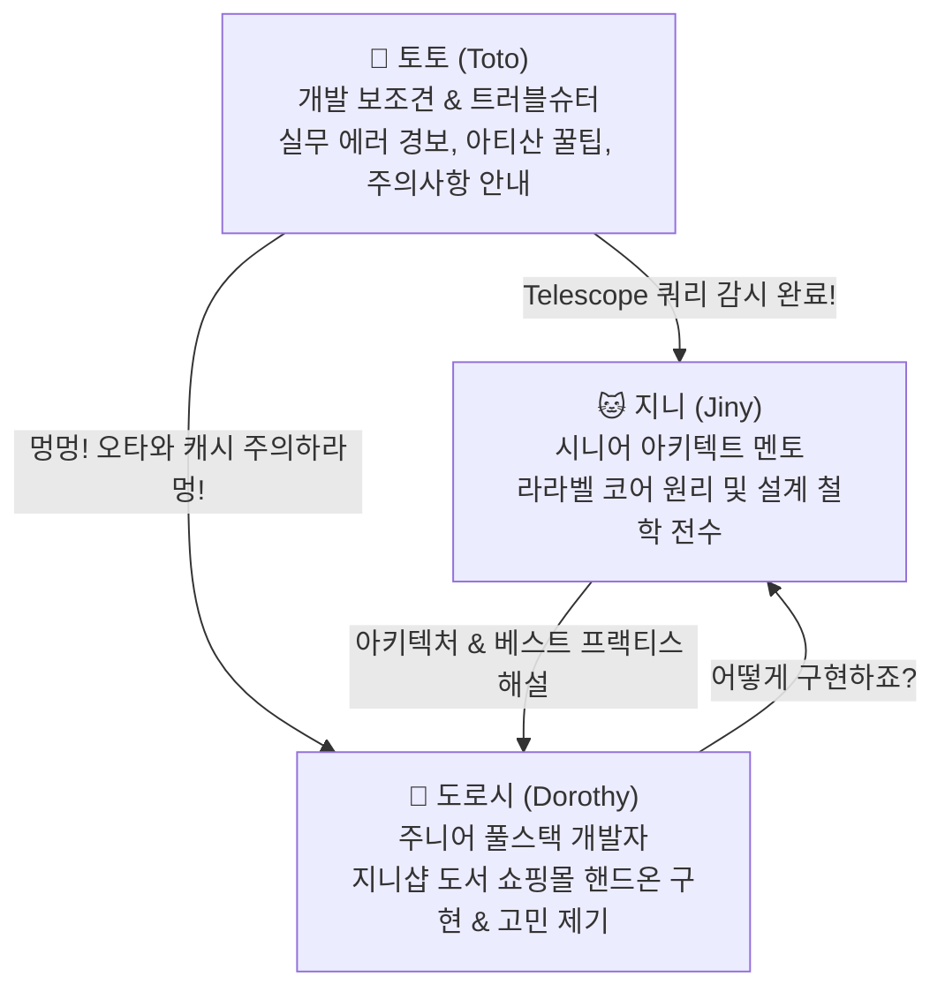


# 📚 지니와 도로시의 라라벨 기반 쇼핑몰 핸드온 개발

> **프로젝트:** 지니샵(JinyShop) — 온라인 도서 쇼핑몰 풀스택 개발  
> **컨셉:** 🐱 지니(시니어 아키텍트 멘토), 👧 도로시(주니어 웹 개발자), 🐶 토토(개발 보조견 & 트러블슈터)가 함께 만들어가는 14주 완성 실전 라라벨 대장정

본 교재는 라라벨(Laravel)의 방대하고 깊이 있는 공식 문서(11개 그룹, 103개 전 주제)를 단순히 주입식으로 암기하는 대신, 가상의 온라인 도서 쇼핑몰인 **'지니샵(JinyShop)'**을 직접 한 줄 한 줄 코딩하며 체화할 수 있도록 돕는 실전 핸드온 가이드입니다.

어려운 소프트웨어 공학 이론과 프레임워크 아키텍처를 세 주인공의 생생한 티키타카 개발 회의와 현장감 넘치는 트러블슈팅 스토리로 풀어내어, 초보 개발자도 지루함 없이 프로덕션 레벨의 엔지니어로 성장할 수 있도록 안내합니다.


---

## 👥 캐릭터 소개 (Characters & Personas)

지니샵(JinyShop) 도서 쇼핑몰을 함께 구축해 나가는 핵심 3인방입니다.



---

### 🐱 지니 (Jiny)
* **포지션**: 시니어 소프트웨어 아키텍트 & 테크 멘토 (Senior Software Architect & Mentor)
* **시각적 특징**: 
  - 보랏빛 털의 날씬하고 세련된 마법 고양이(Slender purple-blue magic cat)
  - 이집트 스핑크스 고양이를 닮은 크고 곧게 선 귀(Large sharp ears)
  - 공중에 둥둥 떠 있으며 신비로운 푸른 마법 연기와 지혜의 반짝이는 별가루에 둘러싸임
  - 3등신 SD 비율, 은은하게 빛나는 시안(Cyan) 색상의 통찰력 넘치는 눈
* **성격 및 역할**: 
  - 라라벨 프레임워크의 내부 동작 메커니즘(요청 생명주기, IoC 서비스 컨테이너, 미들웨어 파이프라인, Eloquent ORM, 큐/이벤트 시스템)을 꿰뚫고 있는 든든한 기술 멘토입니다.
  - 도로시가 "코드가 너무 길어져요", "DB가 느려졌어요", "결제 처리가 불안해요"라고 고민을 털어놓을 때마다, 문제의 본질을 짚어내며 객체지향 원칙(SOLID)과 라라벨다운 우아한 해결책(The Laravel Way)을 제시합니다.
  - 온화하고 여유로우며, 도로시가 스스로 답을 찾을 수 있도록 유도하는 훌륭한 스승입니다.

---

### 👧 도로시 (Dorothy)
* **포지션**: 주니어 웹 풀스택 개발자 & 실습 도전자 (Junior Full-stack Developer & Learner)
* **연령대 및 인상**: 
  - 앳되고 호기심 가득하며 당찬 20대 초반 주니어 개발자 (또는 2.2 ~ 2.5등신 치비 SD 비율의 귀엽고 똘망똘망한 인상)
* **시각적 특징**: 
  - 턱이 뾰족하지 않은 동그란 U자형 얼굴과 빵빵하고 사랑스러운 볼살(Chubby round cheeks)
  - 크고 맑은 검은 눈동자에 또렷한 화이트 하이라이트, 양 볼의 발그레한 핑크빛 볼터치
  - 부드러운 볼륨감의 따뜻한 밀크초콜릿 갈색 웨이브 단발(Voluminous brown bob hair)과 가지런한 앞머리
  - 단정한 화이트 칼라 셔츠에 파스텔 스카이블루 니트 조끼, 네이비 플리츠스커트 착장
  - 코딩용 노트북(스티커가 붙은 맥북)과 개발 노트를 항상 품에 안고 다님
* **성격 및 역할**: 
  - 온라인 도서 쇼핑몰 **지니샵(JinyShop)**을 직접 코딩하여 오픈하겠다는 뜨거운 열정을 품은 주니어 개발자입니다.
  - 초보 학습자의 눈높이에서 독자들이 궁금해할 만한 현실적인 질문("라우트와 컨트롤러는 어떻게 연결하나요?", "장바구니 세션은 브라우저를 닫으면 사라지나요?", "N+1 쿼리가 왜 위험한가요?")을 적극적으로 던집니다.
  - 실패를 두려워하지 않고 에러를 만날 때마다 집요하게 파고들어 마침내 해결해내는 당찬 성장형 캐릭터입니다.

---

### 🐶 토토 (Toto)
* **포지션**: 개발 보조견 & 에러 탐지기 (Dev Assistant & Troubleshooting Specialist)
* **시각적 특징**: 
  - 복슬복슬한 갈색 푸들 강아지(Curly brown poodle puppy)
  - 목에는 작은 공구 모양 펜던트나 라라벨 로고 펜던트가 달린 귀여운 목줄 착용
  - 2등신 앙증맞은 SD 체형, 항상 꼬리를 살랑거리며 집중하고 있음
* **성격 및 역할**: 
  - 도로시의 충직한 개발 파트너이자 지니샵 서버의 알람견입니다.
  - 개발자가 흔히 저지르는 실수(환경 변수 오타, `php artisan config:cache` 후 코드 미반영, 마이그레이션 외래키 순서 꼬임, `storage:link` 누락, CSRF 토큰 누락 등)를 귀신같이 냄새 맡고 짖어댑니다.
  - *"멍멍! 코드를 고쳤는데 화면이 안 바뀌면 `php artisan optimize:clear`를 외치라멍!"* 하고 톡톡 튀는 말투로 실무 꿀팁과 터미널 단축 명령어를 찔러줍니다.

---

## 🎭 스토리텔링 및 대화 전개 가이드 (Storytelling Framework)

본 교재의 모든 주차별 강의(`01강 ~ 04강`) 및 주차 로드맵(`index.md`)은 세 캐릭터의 유기적인 대화와 협업을 통해 진행됩니다.

```text
[스토리텔링 전개 공식]
1. 👧 도로시의 현실적인 비즈니스 고민 제기 (Problem Setting)
   ↳ "지니! 고객이 책 5권을 주문했는데 화면이 멈춰 있어... 컨트롤러에 메일, 결제, 재고 코드가 뒤섞여서 엉망이야!"
   
2. 🐱 지니의 아키텍처 해설 및 라라벨 공식 기능 처방 (Architectural Solution)
   ↳ "도로시, 바로 그럴 때 이벤트(Event)와 비동기 큐(Queue) 패턴을 쓰는 거란다! 주문 컨트롤러는 OrderPlaced 이벤트만 던지고 손님에게 즉시 응답하는 거지."
   
3. 🐶 토토의 실무 꿀팁 및 에러 방지 경보 (Toto's Pro-Tip)
   ↳ "멍멍! 큐 워커를 띄워두고 코드를 고치면 안 먹히니까 `queue:restart`를 잊지 말라멍! 실패한 작업은 Horizon 대시보드에서 확인하자멍!"
```

## 🎨 생성형 일러스트 갤러리 & 실전 개발 대화 (Scenes & Dialogues)

지니샵 교재와 웹사이트에 사용되는 생성형 AI 삽화와 세 캐릭터의 생생한 티키타카 개발 회의 장면입니다.

---

### 씬 1: 📊 서점 데이터베이스 스키마 및 ERD 설계 (Week 04)


👧 **도로시**: "지니! 우리 온라인 서점에는 책(`books`), 회원(`users`), 주문(`orders`) 테이블이 서로 어떻게 연결되어야 해? 외래키를 잘못 걸면 나중에 결제 데이터가 꼬일까 봐 걱정돼!"  

🐱 **지니**: "좋은 질문이야, 도로시! 화이트보드를 보렴. 도서는 저자(`authors`), 출판사(`publishers`), 카테고리(`categories`)와 1:N 및 N:M 관계를 맺고, 주문(`orders`)은 주문 항목(`order_items`)을 통해 도서와 안전하게 분리되어야 한단다. 라라벨 마이그레이션의 `foreignId()->constrained()`를 쓰면 데이터 무결성을 완벽하게 지킬 수 있어."  

🐶 **토토**: "멍멍! 1,000권 도서 데이터를 손으로 입력하지 말고 `php artisan db:seed`를 실행해서 Faker 팩토리로 한 방에 채워넣자멍!"

---

### 씬 2: 🚨 버그 발견 & 실시간 트러블슈팅 (Week 09)


👧 **도로시**: "으악! 화면에 빨간색 에러 창이 떴어! 컨트롤러 코드를 분명히 수정했는데 왜 이전 코드가 계속 실행되면서 에러가 나는 거지? 내 노트북이 고장 난 걸까...?"  

🐱 **지니**: "당황하지 마렴, 도로시. 라라벨은 성능을 위해 라우트와 설정, 뷰 템플릿을 캐싱한단다. 코드를 고친 뒤 캐시가 남아있으면 변경 사항이 즉시 반영되지 않을 수 있어."  

🐶 **토토**: "멍멍! 내가 냄새를 맡았어! 터미널을 열고 **`php artisan optimize:clear`** 명령어를 외치라멍! 설정(`config`), 라우트(`route`), 뷰(`view`) 캐시가 싹 지워지면서 말끔하게 새 코드가 돌아갈 거다멍!"

---

### 씬 3: 💳 PG사 결제 승인 완료 & 환호 (Week 10)


👧 **도로시**: "와아아! 해냈다! 화면에 **'Order Complete! 64,000 KRW'** 초록색 체크 표시가 떴어! 장바구니에 담은 도서 3권이 토스페이먼츠 PG 승인을 통과하고 DB에 안전하게 결제 완료 상태로 저장됐어!"  

🐱 **지니**: "정말 훌륭해! 결제 서비스 프로바이더(`PaymentServiceProvider`)와 결제 파사드(`Payment::charge()`) 아키텍처를 깔끔하게 설계했기 때문에 외부 PG사 통신 실패나 예외 상황에도 DB 트랜잭션이 안전하게 롤백될 수 있었단다."  

🐶 **토토**: "멍멍! 결제가 끝났으니 손님에게 마크다운 영수증 메일을 쏘고, 창고 관리자에게 슬랙(Slack) 알림을 보내는 비동기 큐(`php artisan queue:work`)도 잊지 말고 돌리자멍!"

---

### 씬 4: 🎉 지니샵(JinyShop) 온라인 서점 오픈 & 런칭 축하 (Week 14)


👧 **도로시**: "지니! 토토! 드디어 14주 동안 우리가 밤낮없이 코딩한 **'지니샵(JinyShop)'** 온라인 서점이 정식 오픈했어! 독자들은 모바일 앱과 웹으로 책을 구경하고, 운영자는 관리자 대시보드에서 실시간 주문을 확인하고 있어!"  

🐱 **지니**: "도로시, 포기하지 않고 103개 공식 문서를 전부 체화하며 달려와 줘서 대견하단다. 슬림 아키텍처부터 Pest 테스트, Octane 초고속 서빙, Envoy 무중단 배포까지 모두 갖춘 완벽한 프로덕션 시스템이야."  

🐶 **토토**: "멍멍! 우리 서점 대박 날 것 같다멍! 이제 라라벨의 모든 기능을 통달했으니 어떤 실무 풀스택 프로젝트도 자신 있게 만들 수 있다멍! 파티를 시작하자멍!"

---

## 📖 교재 집필 5대 원칙 (Editorial Guidelines)

1. **쇼핑몰 도메인 일관성 유지**:
   - 추상적인 Foo/Bar 예제는 일절 배제합니다.
   - 도서(`Book`), ISBN, 출판사(`Publisher`), 저자(`Author`), 서평(`Review`), 장바구니(`Cart`), 주문(`Order`), 결제(`Payment`), 배송(`Shipping`) 등 실제 서비스 가능한 구체적 도메인 데이터를 사용합니다.
2. **동작 가능한 완전한 코드 (No Placeholders)**:
   - `// 여기에 로직 작성`과 같은 생략 없이, 복사해서 붙여넣었을 때 즉시 실행되는 완전한 PHP 클래스와 블레이드 템플릿을 제공합니다.
3. **공식 문서 100% 추적성 (Traceability)**:
   - 각 강의마다 해당 기술의 라라벨 공식 문서 위치(`src/docs/...`)를 명시하고, 내부 동작 원리를 심층 분석합니다.
4. **단계별 절차적 핸즈온 (Procedural Steps)**:
   - `1단계: 마이그레이션 생성` $\rightarrow$ `2단계: 모델 작성` $\rightarrow$ `3단계: 컨트롤러 연동` $\rightarrow$ `4단계: 뷰 렌더링` $\rightarrow$ `5단계: 브라우저/CLI 테스트` 순서로 체계적인 학습 흐름을 보장합니다.
5. **토토의 실무 팁과 자가진단 과제 제공**:
   - 각 강의 말미에는 현업에서 자주 겪는 함정을 피하는 🐶 **토토의 팁**과 스스로 이해도를 점검할 수 있는 **자가진단 퀴즈 & 실습 과제**를 배치합니다.

