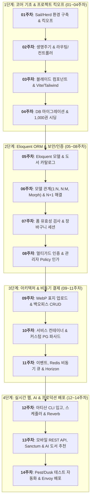


# 🛒 지니와 도로시의 라라벨 기반 도서 쇼핑몰(JinyShop) 14주 핸드온 실습

> **프로젝트명:** 지니샵(JinyShop) — 온라인 도서 쇼핑몰 & 관리자 백오피스 풀스택 구축  
> **교육 방식:** 100% 핸드온(Hands-on) 실습 + 페르소나 대화형 스토리텔링 + 라라벨 13.x 공식 문서 100% 전수 체화  
> **핵심 아키텍처:** 듀얼 트랙(Dual-Track) — 고객용 스토어프론트(Storefront) & 운영자용 관리자 백오피스(Admin Backoffice) 동시 구축  
> **학습 분량:** 14주 총 56개 실습 강좌 (주차별 4강좌 + 종합 가이드)

---

## 💬 14주 핸드온 킥오프 개발 회의

```text
       /\_/\                 (\(\                  /)/)
      ( o.o )               ( -.-)                ( 'x' )
       > ^ <                 o_(")(")              (")_(")
   🐱 지니 (아키텍트)     👧 도로시 (주니어 개발자)    🐶 토토 (트러블슈터)
```

👧 **도로시**: "지니! 드디어 우리가 직접 기획한 온라인 도서 쇼핑몰 **'지니샵(JinyShop)'** 핸드온 실습을 한눈에 볼 수 있는 통합 로드맵이 완성되었어! 14주 동안 어떤 순서로 개발하게 될까?"

🐱 **지니**: "반갑단다, 도로시! 핸드온 실습은 기초 환경 구축부터 시작해서 실무 프로덕션 무중단 배포까지 14주에 걸쳐 빈틈없이 진행된단다. 특히 고객이 책을 검색하고 결제하는 **스토어프론트(Storefront)**와 운영자가 재고와 주문을 관제하는 **관리자 백오피스(Admin Backoffice)**를 듀얼 트랙으로 동시에 구축하면서 라라벨 13의 모든 핵심 기능을 직접 손으로 코딩하게 될 거야."

🐶 **토토**: "멍멍! 왼쪽 사이드바 목차에서 원하는 주차와 강의를 바로바로 클릭해서 이동할 수 있다멍! 실습 코드 예제와 명령어, 트러블슈팅 팁도 가득 준비되어 있으니 힘차게 출발해보자멍!"

---

## 🗺️ 14주 핸드온 종합 로드맵 (Week 01 ~ Week 14)



---

## 📅 주차별 핸드온 상세 목차 (총 14주 56강)

---

## 1단계: 코어 기초 & 프로젝트 킥오프 (01~04주차)


### 💬 1단계 개발 회의: "서점의 뼈대를 세우고 1,000권의 도서를 진열하자!"
👧 **도로시**: "지니! 라라벨 13으로 우리만의 도서 서점 **지니샵**을 시작하는데, 데이터베이스 테이블과 스키마를 어떻게 잡아야 할지 고민돼!"  
🐱 **지니**: "도서(`books`), 저자(`authors`), 출판사(`publishers`), 카테고리(`categories`) 간의 관계를 명확히 설계하고, 라라벨 마이그레이션과 시더(Seeder)를 구축하면 된단다. 1주차부터 4주차까지 따라오면 1,000권의 도서 데이터가 웹 화면에 멋지게 나타날 거야."  
🐶 **토토**: "멍멍! 도서 카드 컴포넌트(`x-book-card`)와 Vite, Tailwind CSS 번들링도 이번 단계에서 완벽히 끝낸다멍!"

---

### [01주차: 온라인 서점 프로젝트 킥오프 & 개발 환경 구축](/week01/)
> **핵심 키워드:** PHP 8.2+, Composer, Laravel Sail, Slim 디렉터리, .env, Pint, Telescope, Laravel Boost  
> **듀얼 트랙:** [프론트] 웰컴 페이지 브라우징 및 폰트 세팅 | [관리자] Telescope 관제소 & 코드 린터 구축

- 📝 [01강: 라라벨 13과의 만남 & 지니샵 프로젝트 생성](/week01/01_kickoff_and_installation/)
- 📝 [02강: 라라벨 13 디렉터리 구조 해부 & 도서 서점 환경 설정 (.env)](/week01/02_directory_and_configuration/)
- 📝 [03강: 코드 스타일러 Pint & 실시간 디버거 Telescope 세팅](/week01/03_dev_tools_pint_and_telescope/)
- 📝 [04강: 에이전트 개발(Agentic Dev) & Laravel Boost 연동](/week01/04_agentic_dev_and_boost/)

---

### [02주차: 라라벨 생명주기와 라우팅 & 컨트롤러 아키텍처](/week02/)
> **핵심 키워드:** HTTP 요청 수명주기, bootstrap/app.php, Route Group, Controller, Request, Response, Redirect  
> **듀얼 트랙:** [프론트] 도서 목록/상세 URL 라우트 | [관리자] `/admin` 라우트 그룹 분리 및 관리자 베이스 컨트롤러

- 📝 [01강: 라라벨 요청 생명주기(Request Lifecycle)와 bootstrap/app.php](/week02/01_request_lifecycle/)
- 📝 [02강: 지니샵 도서 라우팅 시스템 & 네임드 라우트 설계](/week02/02_routing_and_urls/)
- 📝 [03강: 컨트롤러 분리와 HTTP Request 객체 정복](/week02/03_controllers_and_requests/)
- 📝 [04강: 다양한 HTTP 응답(Response), JSON 반환 & 리다이렉트](/week02/04_responses_and_redirects/)

---

### [03주차: 블레이드(Blade) 템플릿과 프론트엔드 에셋 파이프라인](/week03/)
> **핵심 키워드:** Blade Components, Layouts, Slots, Directives, View Composers, Vite, Tailwind CSS  
> **듀얼 트랙:** [프론트] 서점 레이아웃 & 도서 카드 컴포넌트(`x-book-card`) | [관리자] 백오피스 대시보드 사이드바 & 통계 위젯

- 📝 [01강: 블레이드 레이아웃 상속과 컴포넌트-슬롯 아키텍처](/week03/01_blade_layouts_and_components/)
- 📝 [02강: 도서 카드 컴포넌트(`x-book-card`)와 블레이드 제어문](/week03/02_book_card_and_directives/)
- 📝 [03강: 뷰 컴포저(View Composer)로 카테고리 전역 공유 & CSRF 폼 보안](/week03/03_view_composers_and_csrf/)
- 📝 [04강: Vite 번들러, Tailwind CSS 연동 & Head 컴포넌트](/week03/04_vite_tailwind_and_head/)

---

### [04주차: 데이터베이스 마이그레이션과 시더(Seeder), 팩토리(Factory)](/week04/)
> **핵심 키워드:** Migration Schema, Blueprints, Model Factories, Faker, DatabaseSeeder, Rollback  
> **듀얼 트랙:** [프론트] 고객 노출용 도서/저자/출판사/카테고리 스키마 | [관리자] 1,000권 도서 대량 시딩 및 품절 데이터 분리

- 📝 [01강: 라라벨 데이터베이스 연결 설정 & 커넥션 풀 구축](/week04/01_database_config_and_connections/)
- 📝 [02강: 도서·저자·출판사·카테고리 스키마 마이그레이션 작성](/week04/02_bookstore_schema_migrations/)
- 📝 [03강: Faker 기반 모델 팩토리(Model Factory) 설계](/week04/03_faker_model_factories/)
- 📝 [04강: DatabaseSeeder 대량 시딩(1,000권) & `migrate:fresh` 자동화](/week04/04_database_seeder_and_fresh/)

---

## 2단계: Eloquent ORM & 보안/인증 (05~08주차)


### 💬 2단계 개발 회의: "N+1 쿼리를 잡고, 장바구니 세션과 철통 보안을 완성하자!"
👧 **도로시**: "지니! 도서 카탈로그에 리뷰와 저자 정보를 함께 띄웠더니 쿼리가 수백 개나 실행되면서 속도가 너무 느려졌어!"  
🐱 **지니**: "그게 바로 유명한 **N+1 쿼리 문제**란다. Eloquent의 `with(['author', 'reviews'])` Eager Loading을 적용하면 단 2~3개의 쿼리로 해결할 수 있어. 그리고 7~8주차에서는 세션 기반 장바구니와 일반 독자 vs 관리자를 분리하는 멀티가드 인증까지 구현할 거야."  
🐶 **토토**: "멍멍! 화면이 안 바뀌거나 권한 에러가 날 땐 `php artisan optimize:clear`와 Policy 인가 규칙을 꼭 점검하라멍!"

---

### [05주차: Eloquent ORM 기초와 상품 카탈로그 쿼리 최적화](/week05/)
> **핵심 키워드:** Eloquent Models, Casts, Query Scopes, Filtering, Pagination, Soft Deletes, Slugs  
> **듀얼 트랙:** [프론트] 도서 카탈로그, 다조건 필터링, 정렬, 페이지네이션 | [관리자] 절판 도서 소프트 삭제 & 복원 관리

- 📝 [01강: Eloquent 모델 정의, 매스 어사인먼트 & 캐스트(Casts)](/week05/01_eloquent_model_and_casts/)
- 📝 [02강: 쿼리 스코프(Local Scope)와 다조건 도서 필터링](/week05/02_query_scopes_and_filtering/)
- 📝 [03강: 도서 카탈로그 페이지네이션 & 커서(Cursor) 페이징](/week05/03_pagination_and_cursor/)
- 📝 [04강: 소프트 딜리트(Soft Deletes) & SEO 친화적 슬러그(Slug)](/week05/04_soft_deletes_and_slugs/)

---

### [06주차: Eloquent 모델 관계(Relationships) 심화와 N+1 쿼리 해결](/week06/)
> **핵심 키워드:** Relationships (1:N, N:M, MorphMany), Eager Loading, Lazy Eager Loading, N+1 Query, Collections  
> **듀얼 트랙:** [프론트] 도서 상세 다형성 서평(Reviews) & 저자 관련 도서 | [관리자] 서평 블라인드 검수 & N+1 성능 진단

- 📝 [01강: 1:N 저자-도서 & N:M 도서-카테고리 관계 설정](/week06/01_one_to_many_and_many_to_many/)
- 📝 [02강: 다형성(Polymorphic) 관계: 도서/저자 서평 및 첨부 이미지](/week06/02_polymorphic_relationships/)
- 📝 [03강: N+1 쿼리 문제 완전 분석과 Eager Loading(`with`, `load`)](/week06/03_n_plus_one_and_eager_loading/)
- 📝 [04강: Eloquent 컬렉션 함수 활용 & 레이지 컬렉션(LazyCollection)](/week06/04_collections_and_lazy_collections/)

---

### [07주차: 폼 유효성 검사, 세션 상태 관리 & 장바구니 시스템](/week07/)
> **핵심 키워드:** FormRequest, Custom Rules, Validation, Session Driver, Cart Session, Precognition, MongoDB  
> **듀얼 트랙:** [프론트] 장바구니 담기/수량변경, Precognition 실시간 검증 | [관리자] 장바구니 이탈 통계 & MongoDB 감사 로그

- 📝 [01강: FormRequest 유효성 검증과 커스텀 룰(ISBN 검증기)](/week07/01_form_requests_and_custom_rules/)
- 📝 [02강: 세션(Session) 기반 장바구니(Cart) 시스템 구축](/week07/02_session_cart_system/)
- 📝 [03강: Laravel Precognition 기반 실시간 폼 피드백](/week07/03_precognition_live_validation/)
- 📝 [04강: MongoDB 하이브리드 연결을 통한 장바구니 감사 로그 기록](/week07/04_mongodb_hybrid_logging/)

---

### [08주차: 사용자 인증(Auth), 소셜 로그인 & 권한 인가 정책(Policy)](/week08/)
> **핵심 키워드:** Authentication, Guards, Password Hashing, Verification, Gates, Policies, Socialite, Passport  
> **듀얼 트랙:** [프론트] 독자 회원가입/로그인, 소셜 로그인, 서평 수정 인가 | [관리자] 관리자 전용 Gate/Policy & Passport 제휴 API

- 📝 [01강: Laravel Breeze 기반 회원가입, 로그인 & 이메일 인증](/week08/01_breeze_auth_and_verification/)
- 📝 [02강: 비밀번호 재설정 파이프라인과 패스워드 해싱 메커니즘](/week08/02_password_resets_and_hashing/)
- 📝 [03강: Gate와 Policy를 이용한 고객/관리자 권한 분리 인가](/week08/03_gates_and_policies_authorization/)
- 📝 [04강: Socialite 소셜 로그인(구글/카카오) & Passport OAuth2 API 제휴](/week08/04_socialite_and_passport_oauth/)

---

## 3단계: 아키텍처 & 비동기 결제 (09~11주차)


### 💬 3단계 개발 회의: "토스 PG 결제를 뚫고, 비동기 큐로 대량 주문을 처리하자!"
👧 **도로시**: "지니! 고객이 실제 카드로 결제할 때 외부 PG사 API 통신이 지연되거나 실패하면 주문 데이터가 깨질까 봐 두려워!"  
🐱 **지니**: "서비스 컨테이너에 인터페이스 기반으로 PG 결제 엔진을 바인딩하고, DB 트랜잭션을 걸어두면 단 1원의 오차도 없이 안전하게 롤백된단다. 그리고 영수증 메일 발송과 재고 차감은 Redis 비동기 큐(`Queue`)로 빼서 손님에게 즉각적인 응답을 주는 거야."  
🐶 **토토**: "멍멍! 큐 작업 현황은 Laravel Horizon 대시보드에서 실시간 그래프로 한눈에 볼 수 있다멍!"

---

### [09주차: 파일 스토리지, 이미지 처리 & 관리자 백오피스 구축](/week09/)
> **핵심 키워드:** Flysystem, Local/S3 Storage, Image Resizing, WebP, Admin Dashboard, Monolog, Rate Limiting  
> **듀얼 트랙:** [프론트] WebP 고화질 도서 표지 서빙, 친근한 404 페이지 | [관리자] 백오피스 대시보드 CRUD 폼 & Rate Limiting

- 📝 [01강: 파일 시스템(Flysystem)과 도서 표지 이미지 업로드](/week09/01_filesystem_and_file_uploads/)
- 📝 [02강: 이미지 리사이징(Image Resizing)과 WebP 변환 파이프라인](/week09/02_image_resizing_and_webp/)
- 📝 [03강: 관리자 백오피스 대시보드 레이아웃과 도서 관리 CRUD](/week09/03_admin_backoffice_crud/)
- 📝 [04강: 요청 속도 제한(Rate Limiting), 커스텀 에러 페이지 & Monolog 감사 로그](/week09/04_rate_limiting_and_error_pages/)

---

### [10주차: 라라벨 심화 아키텍처 — 컨테이너, 프로바이더 & 결제 파사드](/week10/)
> **핵심 키워드:** Service Container, Dependency Injection, Service Providers, Custom Facades, Payment Gateway  
> **듀얼 트랙:** [프론트] 주문서 작성 및 토스/스트라이프 PG 결제 화면 | [관리자] 결제 대행사 동적 스위칭 프로바이더 & Context 로깅

- 📝 [01강: 서비스 컨테이너(Service Container)와 인터페이스 의존성 주입](/week10/01_service_container_and_contracts/)
- 📝 [02강: 서비스 프로바이더(Service Provider) 등록과 부트스트래핑](/week10/02_service_providers_bootstrapping/)
- 📝 [03강: PG사 결제 연동(Payment Gateway)과 커스텀 결제 파사드(Facade)](/week10/03_custom_payment_facade/)
- 📝 [04강: 헬퍼 함수, Context 기반 로깅 & HTTP 클라이언트 트랜잭션](/week10/04_helpers_context_and_http_client/)

---

### [11주차: 비동기 큐(Queue), 이벤트/리스너, 알림 & 정기 결제](/week11/)
> **핵심 키워드:** Events, Listeners, Redis Queues, Horizon, Markdown Mail, In-App Notifications, Cashier/Paddle  
> **듀얼 트랙:** [프론트] 마크다운 구매 영수증 메일 수신, 북클럽 정기 구독 | [관리자] 고액 주문 Slack 웹훅 경보, Horizon 큐 관제

- 📝 [01강: 이벤트(Events)와 리스너(Listeners)를 이용한 주문 후속 처리 디커플링](/week11/01_events_and_listeners/)
- 📝 [02강: Redis 기반 비동기 큐(Queue Worker)와 Laravel Horizon 모니터링](/week11/02_async_queues_and_horizon/)
- 📝 [03강: 마크다운 메일(Mailables) 영수증 발송 & 실시간 인앱 알림(Notifications)](/week11/03_markdown_mail_and_notifications/)
- 📝 [04강: Laravel Cashier를 이용한 북클럽 정기 구독 결제 & 웹훅 처리](/week11/04_cashier_subscription_billing/)

---

## 4단계: 실시간 웹, AI & 프로덕션 배포 (12~14주차)


### 💬 4단계 개발 회의: "웹소켓 실시간 알림과 AI 도서 요약, 그리고 감격의 상용 배포!"
👧 **도로시**: "지니! 드디어 마지막 단계야! 관리자가 실시간으로 새 주문을 브라우저 새로고침 없이 보고, 독자들에게 AI 기반 도서 추천을 제공하고 싶어!"  
🐱 **지니**: "라라벨 Reverb를 통해 실시간 웹소켓 토스트를 띄우고, Laravel AI SDK와 MCP로 스마트 도서 요약 에이전트를 연동할 거란다. 그리고 Pest/Dusk 브라우저 테스트로 결제 플로우를 완벽 검증한 뒤 Envoy로 무중단 상용 배포를 이뤄내는 거야!"  
🐶 **토토**: "멍멍! 도서 쇼핑몰 지니샵 런칭 성공이다멍! 우리 모두 축하의 파티를 열자멍!"

---

### [12주차: 아티산 CLI 도구, 작업 스케줄링 & 실시간 웹소켓 알림](/week12/)
> **핵심 키워드:** Artisan Console, Laravel Prompts, Task Scheduling, Redis Cache, Concurrency, Reverb, Localization  
> **듀얼 트랙:** [프론트] 다국어(한국어/영어), 통화 표기 스위처, 캐시 서빙 | [관리자] 대화형 재고 입고 CLI, 미결제 자동 취소 크론, Reverb 소켓

- 📝 [01강: 대화형 아티산(Artisan) 콘솔, 라라벨 프롬프트(Prompts) & 프로세스(Processes)](/week12/01_custom_artisan_and_prompts/)
- 📝 [02강: 작업 스케줄링(Task Scheduling)과 자정 배치 자동화](/week12/02_task_scheduling_cron/)
- 📝 [03강: Redis 캐시 아키텍처, 캐시 태그(Cache Tags)와 병렬 동시성(Concurrency)](/week12/03_redis_cache_and_concurrency/)
- 📝 [04강: 라라벨 리버브(Reverb) 웹소켓 실시간 알림 & 다국어(Localization)](/week12/04_reverb_websocket_and_localization/)

---

### [13주차: 모바일 연동 RESTful API, Sanctum 토큰 인증, 전문 검색 & AI 도서 요약](/week13/)
> **핵심 키워드:** RESTful API, API Resources, Sanctum Tokens, Laravel Scout, Folio, Laravel AI SDK, MCP  
> **듀얼 트랙:** [프론트] 모바일 앱 연동 API, 10ms Scout 전문 검색, 기획전 | [관리자] AI SDK 마케팅 카피 자동 생성, MCP 에이전트 도구

- 📝 [01강: 모바일 RESTful API 설계, Eloquent API 리소스 & 직렬화(Serialization)](/week13/01_restful_api_and_resources/)
- 📝 [02강: 라라벨 생텀(Sanctum) 모바일 API 토큰 인증 & 페넌트(Pennant) 피처 플래그](/week13/02_sanctum_token_authentication/)
- 📝 [03강: 라라벨 스카우트(Scout) 전문 검색(Full-text Search) & 폴리오(Folio) 기획전 라우팅](/week13/03_scout_fulltext_search/)
- 📝 [04강: 라라벨 AI SDK, 모델 컨텍스트 프로토콜(MCP) & 스마트 도서 에이전트](/week13/04_ai_sdk_and_mcp_integration/)

---

### [14주차: 도서 구매 플로우 테스트 자동화, 브라우저 E2E, 모니터링 & 프로덕션 배포](/week14/)
> **핵심 키워드:** Pest, PHPUnit, Mocking, Dusk Browser E2E, Laravel Pulse, Laravel Octane, Envoy Deployment  
> **듀얼 트랙:** [프론트] 고객 구매 플로우 Feature 테스트 & Dusk E2E 테스트 | [관리자] Pulse APM 모니터링, Octane 초고속 서빙 & 무중단 Envoy 배포

- 📝 [01강: 단위 & 기능 테스트(Pest/PHPUnit), 데이터베이스 테스트 & 모킹(Mocking)](/week14/01_pest_phpunit_testing/)
- 📝 [02강: 라라벨 더스크(Dusk)를 이용한 브라우저 E2E 구매 시나리오 자동화](/week14/02_dusk_browser_e2e_testing/)
- 📝 [03강: 라라벨 펄스(Pulse) 실시간 APM 모니터링 & 옥탄(Octane) 초고속 메모리 상주 서빙](/week14/03_pulse_monitoring_and_octane/)
- 📝 [04강: 무중단 엔보이(Envoy) 배포, 패키지 개발 & 릴리스 업그레이드](/week14/04_envoy_deployment_and_releases/)

