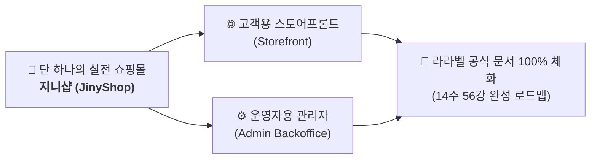


# 📚 지니와 도로시의 라라벨 기반 온라인 서점(JinyShop) 14주 핸드온 완성 과정

> **프로젝트명:** 지니샵(JinyShop) — 온라인 도서 쇼핑몰 & 관리자 백오피스 풀스택 구축  
> **교육 대상:** PHP/라라벨 초보자부터 실무 풀스택 개발을 체화하고자 하는 주니어 개발자  
> **강좌 방식:** 100% 핸드온 실습 + 친근한 스토리텔링 대화(지니, 도로시, 토토) + 공식 문서 100% 매핑  
> **핵심 아키텍처:** 듀얼 트랙(Dual-Track) — 고객용 스토어프론트(Storefront) & 운영자용 관리자 백오피스(Admin Backoffice) 동시 구축  

---

## 🧭 핵심 자료 퀵 내비게이션 (Quick Links)

| 문서 | 파일 링크 | 주요 설명 |
| :--- | :--- | :--- |
| **📘 학습 가이드** | [guide.md](./guide.md) | 전체 실습 환경, 설치 명령어, 학습 사이클 및 베스트 프랙티스 안내 |
| **📑 강의 계획서** | [syllabus.md](./syllabus.md) | 14주 종합 커리큘럼 계획표 및 라라벨 공식 문서 103개 주제 커버리지 매핑표 |
| **👥 등장인물 가이드** | [character.md](./character.md) | 멘토 고양이 지니, 주니어 개발자 도로시, 디버깅 보조견 토토의 캐릭터 소개 |
| **📖 라라벨 공식 문서** | [docs/ 바로가기](./docs/readme_ko.md) | 라라벨 공식 영문 문서 106편에 대한 100% 전수 한국어 번역 및 아카이브 |

---

## 💬 지니, 도로시, 토토의 환영 인사말

```text
       /\_/\                 (\(\                  /)/)
      ( o.o )               ( -.-)                ( 'x' )
       > ^ <                 o_(")(")              (")_(")
   🐱 지니 (아키텍트)     👧 도로시 (주니어 개발자)    🐶 토토 (트러블슈터)
```

👧 **도로시**: "안녕하세요! 라라벨을 처음 시작하는 주니어 개발자 도로시예요! 책과 독자, 그리고 관리자가 유기적으로 소통하는 멋진 온라인 서점 **'지니샵(JinyShop)'**을 직접 만들고 싶어서 지니와 토토와 함께 이 여정을 시작했어요!"  

🐱 **지니**: "반갑단다, 도로시와 학습자 여러분! 라라벨은 현대 웹 생태계에서 가장 우아하고 강력한 PHP 풀스택 프레임워크란다. 우리는 딱딱한 공식 문서를 무작정 외우는 대신, **'지니샵'**이라는 실전 상용 쇼핑몰을 1주차부터 14주차까지 실제로 코딩하면서 라라벨의 모든 기능을 자연스럽게 체화할 거란다."  

🐶 **토토**: "멍멍! 실습하다가 에러가 나거나 막히면 언제든 날 불러달라멍! 설치 팁, `.env` 설정, 마이그레이션 롤백, 실시간 쿼리 디버깅까지 내가 꼬리를 흔들며 도와줄 테니 두려워 말고 따라오라멍!"

---

## 🌟 본 과정의 3대 핵심 학습 원칙



### 1. 단 하나의 살아있는 쇼핑몰 프로젝트 ("JinyShop")
파편화된 일회성 예제 대신, 1,000권 이상의 도서 카탈로그, 장바구니 세션, 회원가입/소셜 로그인, PG사 결제 연동, 비동기 주문 처리, 재고 관리 및 AI 상품 추천까지 갖춘 **완전한 이커머스 시스템**을 구축합니다.

### 2. 스토어프론트 & 관리자 백오피스 듀얼 트랙 (Dual-Track)
- **독자/고객용 프론트 (Storefront):** 베스트셀러 브라우징, 카테고리 필터링, 검색, 장바구니, 마크다운 영수증 이메일 수신, 결제.
- **운영자용 관리자 (Admin Backoffice):** 도서 등록/수정 CRUD, 재고 입고 CLI, 미결제 자동 취소 스케줄러, 실시간 주문 관제(Horizon/Pulse).

### 3. 공식 문서의 100% 완전 흡수 (No Reduction, No Omission)
라라벨 공식 문서의 11개 그룹, 103개 핵심 주제 전체를 실습 맥락에 맞추어 분리·병합·재배치하였습니다. 각 강의는 실제 동작하는 PHP/Blade 코드와 함께 공식 문서의 원리를 완벽하게 설명합니다.

---

## 📅 14주 마스터 로드맵 & 주차별 상세 목차 (Weekly Index)

아래 14개의 주차별 링크를 클릭하여 순서대로 실습을 진행하세요. 각 주차는 1개의 종합 가이드와 4개의 절차적 실습 챕터(총 56강)로 구성되어 있습니다.

---

### [01주차: 온라인 서점 프로젝트 킥오프 & 개발 환경 구축](./week01/index.md)
> **핵심 키워드:** PHP 8.2+, Composer, Laravel Sail, Slim 디렉터리, .env, Pint, Telescope, Laravel Boost  
> **듀얼 트랙:** [프론트] 웰컴 페이지 브라우징 및 폰트 세팅 | [관리자] Telescope 관제소 & 코드 린터 구축

- 📝 [01강: 라라벨 13과의 만남 & 지니샵 프로젝트 생성](./week01/01_kickoff_and_installation.md)
- 📝 [02강: 라라벨 13 디렉터리 구조 해부 & 도서 서점 환경 설정 (.env)](./week01/02_directory_and_configuration.md)
- 📝 [03강: 코드 스타일러 Pint & 실시간 디버거 Telescope 세팅](./week01/03_dev_tools_pint_and_telescope.md)
- 📝 [04강: 에이전트 개발(Agentic Dev) & Laravel Boost 연동](./week01/04_agentic_dev_and_boost.md)

---

### [02주차: 라라벨 생명주기와 라우팅 & 컨트롤러 아키텍처](./week02/index.md)
> **핵심 키워드:** HTTP 요청 수명주기, bootstrap/app.php, Route Group, Controller, Request, Response, Redirect  
> **듀얼 트랙:** [프론트] 도서 목록/상세 URL 라우트 | [관리자] `/admin` 라우트 그룹 분리 및 관리자 베이스 컨트롤러

- 📝 [01강: 라라벨 요청 생명주기(Request Lifecycle)와 bootstrap/app.php](./week02/01_request_lifecycle.md)
- 📝 [02강: 지니샵 도서 라우팅 시스템 & 네임드 라우트 설계](./week02/02_routing_and_urls.md)
- 📝 [03강: 컨트롤러 분리와 HTTP Request 객체 정복](./week02/03_controllers_and_requests.md)
- 📝 [04강: 다양한 HTTP 응답(Response), JSON 반환 & 리다이렉트](./week02/04_responses_and_redirects.md)

---

### [03주차: 블레이드(Blade) 템플릿과 프론트엔드 에셋 파이프라인](./week03/index.md)
> **핵심 키워드:** Blade Components, Layouts, Slots, Directives, View Composers, Vite, Tailwind CSS  
> **듀얼 트랙:** [프론트] 서점 레이아웃 & 도서 카드 컴포넌트(`x-book-card`) | [관리자] 백오피스 대시보드 사이드바 & 통계 위젯

- 📝 [01강: 블레이드 레이아웃 상속과 컴포넌트-슬롯 아키텍처](./week03/01_blade_layouts_and_components.md)
- 📝 [02강: 도서 카드 컴포넌트(`x-book-card`)와 블레이드 제어문](./week03/02_book_card_and_directives.md)
- 📝 [03강: 뷰 컴포저(View Composer)로 카테고리 공유 & CSRF 보안 토큰](./week03/03_view_composers_and_csrf.md)
- 📝 [04강: Vite 번들러, Tailwind CSS 연동 & Head 컴포넌트](./week03/04_vite_tailwind_and_head.md)

---

### [04주차: 데이터베이스 마이그레이션과 시더(Seeder), 팩토리(Factory)](./week04/index.md)
> **핵심 키워드:** Database Schema, Migrations, Foreign Key, Index, Faker, Factory, DatabaseSeeder  
> **듀얼 트랙:** [프론트] 도서·저자·출판사 테이블 설계 | [관리자] 대량 1,000권 도서 더미 데이터 생성 및 절판 플래그 시딩

- 📝 [01강: 데이터베이스 설정 다중화 & 커넥션 풀 구축](./week04/01_database_config_and_connections.md)
- 📝 [02강: 도서·저자·카테고리 스키마 마이그레이션 작성](./week04/02_bookstore_schema_migrations.md)
- 📝 [03강: Faker 기반 모델 팩토리(Model Factory) 설계](./week04/03_faker_model_factories.md)
- 📝 [04강: DatabaseSeeder 대량 시딩 & `migrate:fresh` 자동화](./week04/04_database_seeder_and_fresh.md)

---

### [05주차: Eloquent ORM 기초와 상품 카탈로그 쿼리 최적화](./week05/index.md)
> **핵심 키워드:** Eloquent ActiveRecord, Attribute Casting, Local Scopes, Pagination, Cursor Pagination, Soft Deletes  
> **듀얼 트랙:** [프론트] 도서 카탈로그 다조건 검색 & 페이징 UI | [관리자] 절판 도서 소프트 삭제 복원 및 영구 삭제 기능

- 📝 [01강: Eloquent 모델 정의, 매스 어사인먼트 & 캐스트(Casts)](./week05/01_eloquent_model_and_casts.md)
- 📝 [02강: 쿼리 스코프(Local Scope)와 조건별 도서 필터링](./week05/02_query_scopes_and_filtering.md)
- 📝 [03강: 도서 카탈로그 페이지네이션 & 커서(Cursor) 페이징](./week05/03_pagination_and_cursor.md)
- 📝 [04강: 소프트 딜리트(Soft Deletes) & SEO 친화적 슬러그(Slug)](./week05/04_soft_deletes_and_slugs.md)

---

### [06주차: Eloquent 모델 관계(Relationships) 심화와 N+1 쿼리 해결](./week06/index.md)
> **핵심 키워드:** 1:N (HasMany), N:M (BelongsToMany), 다형성 관계(MorphMany), Eager Loading, Collection Methods  
> **듀얼 트랙:** [프론트] 도서 상세 서평(Review) 작성 및 별점 표시 | [관리자] N+1 쿼리 진단 및 악성 서평 블라인드 관리

- 📝 [01강: 1:N 저자-도서 & N:M 도서-카테고리 관계 설정](./week06/01_one_to_many_and_many_to_many.md)
- 📝 [02강: 다형성(Polymorphic) 관계: 도서/저자 서평 및 첨부 이미지](./week06/02_polymorphic_reviews_and_images.md)
- 📝 [03강: N+1 쿼리 문제 완전 분석과 Eager Loading(`with`, `load`)](./week06/03_n_plus_one_and_eager_loading.md)
- 📝 [04강: Eloquent 컬렉션 함수 활용 & 레이지 컬렉션(LazyCollection)](./week06/04_collections_and_lazy_collections.md)

---

### [07주차: 폼 유효성 검사, 세션 상태 관리 & 장바구니 시스템](./week07/index.md)
> **핵심 키워드:** FormRequest, Custom Validation Rules, Session Storage, Precognition, MongoDB Hybrid  
> **듀얼 트랙:** [프론트] 장바구니 담기/수량변경 & 실시간 유효성 검사 | [관리자] 장바구니 이탈률 통계 & 사용자 행동 MongoDB 로그

- 📝 [01강: FormRequest 유효성 검증과 커스텀 룰(ISBN 검증기)](./week07/01_form_validation_and_custom_rules.md)
- 📝 [02강: 세션(Session) 기반 장바구니(Cart) 시스템 구축](./week07/02_session_cart_system.md)
- 📝 [03강: Laravel Precognition 기반 실시간 폼 피드백](./week07/03_precognition_realtime_validation.md)
- 📝 [04강: MongoDB 하이브리드 연결을 통한 장바구니 감사 로그 기록](./week07/04_mongodb_hybrid_cart_logs.md)

---

### [08주차: 사용자 인증(Auth), 소셜 로그인 & 권한 인가 정책(Policy)](./week08/index.md)
> **핵심 키워드:** Laravel Breeze, Email Verification, Multi-Guard (User vs Admin), Gate, Policy, Socialite  
> **듀얼 트랙:** [프론트] 독자 회원가입, 이메일 인증, 카카오/구글 로그인 | [관리자] 관리자 전용 Guard(`admin`) & 서평 검수 Gate/Policy

- 📝 [01강: Laravel Breeze 기반 회원가입, 로그인 & 이메일 인증](./week08/01_authentication_and_verification.md)
- 📝 [02강: 비밀번호 재설정 파이프라인과 패스워드 해싱 메커니즘](./week08/02_passwords_and_encryption.md)
- 📝 [03강: Gate와 Policy를 이용한 고객/관리자 권한 분리 인가](./week08/03_authorization_gates_and_policies.md)
- 📝 [04강: Socialite 소셜 로그인(구글/카카오) & Passport OAuth2 API 제휴](./week08/04_socialite_and_oauth_passport.md)

---

### [09주차: 파일 스토리지, 이미지 처리 & 관리자 백오피스 대시보드](./week09/index.md)
> **핵심 키워드:** Flysystem, storage:link, WebP Image Optimization, Admin Middleware, Rate Limiting, Monolog  
> **듀얼 트랙:** [프론트] 도서 표지 WebP 최적화 로딩 & 감성 404 페이지 | [관리자] 관리자 전용 대시보드, 도서 등록 CRUD & 침입 감사 로그

- 📝 [01강: 파일시스템(Filesystem) 추상화와 `storage:link` 심볼릭 링크](./week09/01_filesystem_and_storage_link.md)
- 📝 [02강: 도서 표지 이미지 업로드 & WebP 변환 최적화](./week09/02_image_optimization_and_webp.md)
- 📝 [03강: 관리자 전용 미들웨어(`EnsureUserIsAdmin`) & 백오피스 CRUD](./week09/03_admin_middleware_and_backoffice.md)
- 📝 [04강: Rate Limiting(속도 제한) 방어선 구축 & Monolog 보안 감사 로그](./week09/04_rate_limiting_and_monolog.md)

---

### [10주차: 라라벨 코어 심화 (서비스 컨테이너, 프로바이더, 파사드)](./week10/index.md)
> **핵심 키워드:** Service Container, Dependency Injection, Service Providers, Custom Facade, HTTP Client, Context  
> **듀얼 트랙:** [프론트] 토스/스트라이프 PG 결제 모듈 호출 | [관리자] 결제 게이트웨이 동적 스위칭 프로바이더 & 결제 감사 Context

- 📝 [01강: 서비스 컨테이너(Service Container)와 의존성 주입(DI)](./week10/01_service_container_and_contracts.md)
- 📝 [02강: 서비스 프로바이더(Service Provider)와 결제 게이트웨이 바인딩](./week10/02_service_providers_binding.md)
- 📝 [03강: 파사드(Facades) 내부 동작 원리와 커스텀 결제 파사드 제작](./week10/03_facades_internals_and_custom_facade.md)
- 📝 [04강: HTTP 클라이언트로 외부 국립도서관 API 연동 & Context 추적](./week10/04_http_client_and_context.md)

---

### [11주차: 이벤트, 비동기 큐(Queue), 알림 시스템 & 주문/결제 연동](./week11/index.md)
> **핵심 키워드:** DB Transactions, Pessimistic Locking, Events & Listeners, Redis Queue, Mailable, Laravel Horizon  
> **듀얼 트랙:** [프론트] 주문 결제 파이프라인, 마크다운 영수증 메일 수신 | [관리자] Slack 고액 주문 경보 & Laravel Horizon 큐 모니터링

- 📝 [01강: 주문 결제 파이프라인 구축: DB 트랜잭션과 비관적 락](./week11/01_events_and_listeners.md)
- 📝 [02강: Redis 기반 비동기 큐(Queue) 처리와 Laravel Horizon 관제](./week11/02_async_queues_and_horizon.md)
- 📝 [03강: 마크다운 메일(Mailables) 발송과 다채널 알림(Notifications)](./week11/03_mailables_and_notifications.md)
- 📝 [04강: 정기 구독 결제(Cashier / Paddle) 모델 구축](./week11/04_cashier_stripe_paddle.md)

---

### [12주차: 아티산 CLI 확장, 스케줄링, 캐시 & 웹소켓 실시간 브로드캐스팅](./week12/index.md)
> **핵심 키워드:** Artisan Command, Laravel Prompts, Task Scheduling, Redis Cache, Laravel Reverb, Localization  
> **듀얼 트랙:** [프론트] 다국어(ko/en/ja) 스위칭 & 베스트셀러 고속 캐싱 | [관리자] 대화형 재고 입고 CLI, 미결제 자동 취소 크론, 실시간 주문 토스트

- 📝 [01강: 커스텀 아티산 명령어(`shop:restock`)와 대화형 Prompts 제작](./week12/01_custom_artisan_and_prompts.md)
- 📝 [02강: 작업 스케줄링(Cron)으로 미결제 주문 자동 취소 파이프라인](./week12/02_task_scheduling_cron.md)
- 📝 [03강: Redis 캐싱 전략, 태그 기반 무효화 & 동시성(Concurrency)](./week12/03_redis_cache_and_concurrency.md)
- 📝 [04강: Laravel Reverb 실시간 웹소켓 주문 알림 & 다국어(Localization)](./week12/04_reverb_websocket_and_localization.md)

---

### [13주차: RESTful API, Sanctum 토큰 인증, 풀텍스트 검색 & AI 기능 탑재](./week13/index.md)
> **핵심 키워드:** API Resources, Laravel Sanctum, Laravel Scout, Laravel AI SDK, Model Context Protocol (MCP)  
> **듀얼 트랙:** [프론트] 모바일 앱 연동 RESTful API, 10ms Scout 검색 | [관리자] AI 도서 마케팅 카피 자동 생성 & 재고 조회 AI MCP 에이전트

- 📝 [01강: API 리소스(Resource) 가공과 RESTful 엔드포인트 설계](./week13/01_restful_api_and_resources.md)
- 📝 [02강: Laravel Sanctum 모바일 앱 토큰 인증 및 만료 관리](./week13/02_sanctum_token_authentication.md)
- 📝 [03강: Laravel Scout 기반 도서 전문 검색(Full-text Search)](./week13/03_scout_fulltext_search.md)
- 📝 [04강: Laravel AI SDK 상품 추천 & AI 에이전트 연동 MCP 도구](./week13/04_ai_sdk_and_mcp_integration.md)

---

### [14주차: 테스트 자동화, 모니터링(Pulse), 성능 최적화 & 프로덕션 배포](./week14/index.md)
> **핵심 키워드:** Pest/PHPUnit, Feature Testing, Laravel Dusk (E2E), Laravel Pulse, Octane, Envoy Deployment  
> **듀얼 트랙:** [프론트] 주문 플로우 E2E 브라우저 테스트 | [관리자] Laravel Pulse APM 관제, Octane 고속화 & 무중단 배포

- 📝 [01강: Pest & PHPUnit 기반 단위/기능(Feature) 테스트 작성](./week14/01_pest_phpunit_testing.md)
- 📝 [02강: Laravel Dusk 브라우저 E2E 테스트로 구매 플로우 검증](./week14/02_dusk_browser_e2e_testing.md)
- 📝 [03강: Laravel Pulse 성능 모니터링 & Laravel Octane 초고속 서빙](./week14/03_pulse_monitoring_and_octane.md)
- 📝 [04강: Laravel Envoy 무중단 배포 스크립트 작성 & 릴리스 관리](./week14/04_envoy_deployment_and_releases.md)

---

## 🛠️ 권장 학습 루틴 및 실습 가이드

각 주차 및 강좌를 가장 효과적으로 완주하기 위한 추천 5단계 학습 루틴입니다:

1. **캐릭터 대화 읽기 (Story Catch-up):**  
   각 챕터 상단의 🐱 지니, 👧 도로시, 🐶 토토의 대화를 읽고, "우리가 왜 이 기능을 만드는가?"를 직관적으로 이해합니다.
2. **공식 문서 원리 확인 (Core Principles):**  
   라라벨 공식 문서가 권장하는 베스트 프랙티스와 아키텍처 원리를 확인합니다.
3. **코드 직접 타이핑 (Hands-on Coding):**  
   제시된 완성형 PHP/Blade 코드를 여러분의 로컬 라라벨 프로젝트에 직접 입력하거나 수정합니다.
4. **브라우저 및 터미널 검증 (Dual-Track Test):**  
   - 스토어프론트: 독자 관점에서 화면이 의도대로 렌더링되는지 확인합니다.
   - 백오피스: 관리자 관점에서 데이터가 정상 반영되는지 확인합니다.
5. **토토의 트러블슈팅 & 회고 (Toto's Checklist):**  
   강의 말미의 주의사항과 디버깅 팁을 통해 잠재적 버그와 성능 이슈를 점검합니다.

---

> 🚀 **준비가 되셨나요?**  
> 지금 바로 **[01주차: 온라인 서점 프로젝트 킥오프 & 개발 환경 구축](./week01/index.md)**으로 이동하여 지니, 도로시, 토토와 함께 첫 코딩을 시작해 보세요!

